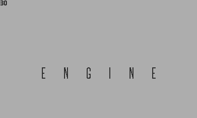

# Taxman engine for Playdate

This is the Playdate console port of the [Taxman Engine](https://github.com/mcdevon/taxman-engine).

This repository contains the gecko demo, including

- Loading scene with Taxman Engine animation
- Scene change with fade to black in between
- Gecko scene with working controls and an animated lizard character, controllable with crank
- Camera, movable with the d-pad or following the character



## Notes

- This console port is a work in progress, and has still missing features, such as audio support

## How to use

An XCode project is provided, but the project can be developed with other code editors as well. All game code should be placed inside `game` directory. All assets should be placed in `assets` directory. The `launcher_images` directory within the assets is special and contains the icons and launcher images for the game.

To set the name of the project, edit the `pdxinfo` file in the assets directory.

To update the makefiles with the new project name and all possibly added code files, and to create sprite sheets and copy assets, run

```
scripts/update_project.sh
```

This requires `python` and the Pillow library, which can be installed by running

```
python -m pip install pillow
```

To build the game, run

```
make
```

This will create a `.pdx` file named after the project, as set in `assets/pdxinfo`. Double-clicking the file in Finder will open it in the Playdate Simulator. From the simulator menu, it can be uploaded to a device by selecting `Device -> Upload Game to Device`.

The gecko demo that comes with the repository should be directly runnable by itself.

# Licenses:

### uPNG -- derived from LodePNG version 20100808

```Copyright (c) 2005-2010 Lode Vandevenne
Copyright (c) 2010 Sean Middleditch

This software is provided 'as-is', without any express or implied
warranty. In no event will the authors be held liable for any damages
arising from the use of this software.

Permission is granted to anyone to use this software for any purpose,
including commercial applications, and to alter it and redistribute it
freely, subject to the following restrictions:

1. The origin of this software must not be misrepresented; you must not
   claim that you wrote the original software. If you use this software
   in a product, an acknowledgment in the product documentation would be
   appreciated but is not required.

2. Altered source versions must be plainly marked as such, and must not be
   misrepresented as being the original software.

3. This notice may not be removed or altered from any source
   distribution.
```
